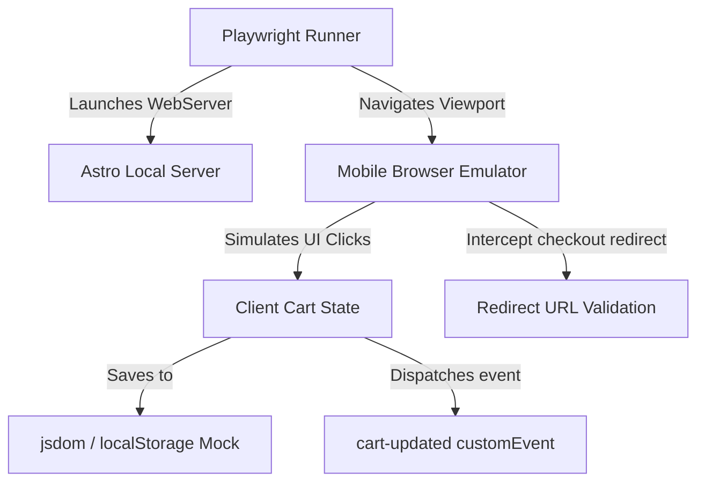

# Technical Design: Setup Automated Testing

This document defines the architecture, tools, configuration, and execution patterns for establishing unit testing (Vitest) and End-to-End browser testing (Playwright) within `menudigital`.

## 1. Technical Approach & Architecture

We will implement a two-tiered testing approach:
1. **Unit/Logic Testing (Vitest)**: Fast execution of core business logic in [cartStore.ts](file:///C:/Users/Brasero/Documents/Clases%20programacion/Menudigital/src/utils/cartStore.ts). Run in `jsdom` to emulate local storage and browser event loops.
2. **End-to-End UI Testing (Playwright)**: Full browser interaction testing on emulated mobile viewports. Integrates a local development server for hermetic environment execution.

### Data Flow



## 2. Directory Structure

All test-related files will live in a unified `tests` root directory.

```
menudigital/
├── tests/
│   ├── unit/
│   │   └── cartStore.test.ts      # Unit tests for cart store logic
│   └── e2e/
│       └── checkout.spec.ts       # Playwright checkout flow & WhatsApp redirection tests
├── vitest.config.ts               # Vitest configuration
└── playwright.config.ts           # Playwright configuration
```

## 3. Package Installations

The following development dependencies will be added to `package.json`:

```json
"devDependencies": {
  "vitest": "^2.0.0",
  "jsdom": "^24.1.0",
  "@vitest/coverage-v8": "^2.0.0",
  "@playwright/test": "^1.45.0"
}
```

We will also update `package.json` scripts:
* `"test"`: `"vitest run"`
* `"test:watch"`: `"vitest"`
* `"test:coverage"`: `"vitest run --coverage"`
* `"test:e2e"`: `"playwright test"`

## 4. Configurations

### Vitest Config (`vitest.config.ts`)

```typescript
import { defineConfig } from 'vitest/config';

export default defineConfig({
  test: {
    environment: 'jsdom',
    globals: true,
    include: ['tests/unit/**/*.{test,spec}.ts'],
    coverage: {
      provider: 'v8',
      reporter: ['text', 'json', 'html'],
      include: ['src/utils/cartStore.ts'],
    },
  },
});
```

### Playwright Config (`playwright.config.ts`)

```typescript
import { defineConfig, devices } from '@playwright/test';

export default defineConfig({
  testDir: './tests/e2e',
  fullyParallel: true,
  forbidOnly: !!process.env.CI,
  retries: process.env.CI ? 2 : 0,
  workers: process.env.CI ? 1 : undefined,
  reporter: 'list',
  use: {
    baseURL: 'http://localhost:4321',
    trace: 'on-first-retry',
  },
  projects: [
    {
      name: 'Mobile Safari',
      use: { ...devices['iPhone 12'] },
    },
    {
      name: 'Mobile Chrome',
      use: { ...devices['Pixel 5'] },
    },
  ],
  webServer: {
    command: 'npm run dev',
    url: 'http://localhost:4321',
    reuseExistingServer: !process.env.CI,
    timeout: 10 * 1000,
  },
});
```

## 5. Interfaces & Redirection Interception

### Unit Test Interacting with LocalStorage
To ensure clean isolation, we clear and mock `localStorage` before every unit test:
```typescript
import { beforeEach, describe, it, expect } from 'vitest';
import { getCart, addToCart, clearCart } from '../../src/utils/cartStore';

beforeEach(() => {
  localStorage.clear();
  clearCart();
});
```

### E2E Redirection Interception Strategy
To prevent actual redirection to the external WhatsApp API, we intercept navigation via page listeners:
```typescript
test('should construct correct WhatsApp redirect payload', async ({ page }) => {
  await page.goto('/');
  // Add items and open checkout sheet...
  
  // Intercept navigation target
  const navigationPromise = page.waitForEvent('framenavigated', {
    predicate: (frame) => frame.url().includes('api.whatsapp.com') || frame.url().includes('wa.me')
  });
  
  // Trigger order submit...
  // Assert intercepted query parameters
});
```
Or override `window.location.assign` / `window.location.href` via client-side script evaluation before execution.

## 6. Migration & Rollout

* Local developer setup requires running `npx playwright install --with-deps` to provision browser binaries.
* Running `npm run test` executes unit tests.
* Running `npm run test:e2e` spins up the local dev server at `http://localhost:4321` and runs playwright suites against Safari/Chrome mobile viewports.
